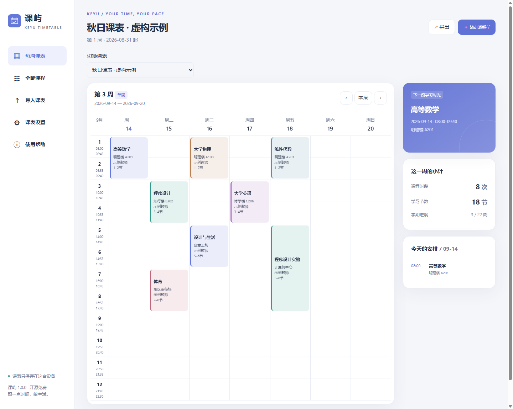

# 课屿 Keyu

本地导入课表、按周查看、离线保存。独立开发，不隶属 WakeUp 或华南理工大学。

> 当前为开源体验版，各品牌真机兼容性仍需验证。已通过的检查与待测项见 [验证记录](docs/VALIDATION.md)。

[浏览器版](https://kevinkaslana093.github.io/keyu-timetable/) · [下载 Android APK](https://github.com/KevinKaslana093/keyu-timetable/releases)



## 使用

1. 导入你自己的华工教务文字版 PDF，或符合七列表头的 XLSX / CSV / HTML。
2. 核对完整预览。确认后新建课表，已有数据保留。
3. 设置校历“第 1 周周一”、校区节次时间、学期周数。
4. 按学校通知添加停课、补课；需要提醒时导出 ICS，或使用 Android 本地通知。

课表文件不上传。公开项目中不包含真实学生 PDF、姓名、学号或个人课表。内置示例完全虚构。

## 已实现的功能

- 七天周视图、课程列表搜索、手工增删改、多课表、深浅主题。
- 华工 PDF 按坐标分列、处理页面旋转、跨页续接、多时段、单双周与间断周。
- 无具体星期节次的实践课作为学期事项，避免静默遗漏。
- WakeUp 官方七列 CSV 格式导入导出，XLSX 第一张工作表及同表头 HTML 导入。
- JSON 完整课表备份，导入新建而非覆盖。
- UTC+8 日历导出、指定日期停课与原日期课程补课。
- PWA 离线缓存，Android WebView 本地资源、系统文件选择器、私有存储与系统通知代码。

## 格式边界

CSV / XLSX / HTML 列顺序：

| 课程名称 | 星期 | 开始节数 | 结束节数 | 老师 | 地点 | 周数 |
|---|---|---|---|---|---|---|
| 示例课程 | 1 | 1 | 2 | 示例教师 | 教学楼101 | 3-12、15-18 |

星期 1—7；周数支持 `3-17单`、`4-18双`、`3-12、15-18`。Excel 周数列请设为文本，旧版 `.xls` 请另存 `.xlsx` 或 CSV。PDF 不支持扫描件 / 截图型 PDF。HTML 目前仅解析七列数据表，不冒充通用教务网页适配器。

尚未实现：学校账号直连、任意学校 PDF / 任意布局 Excel、图片 OCR、WakeUp 私有备份/分享口令、ICS 导入、桌面小组件、iCloud、原生 iOS / HarmonyOS 安装包。浏览器关闭后的可靠提醒使用系统日历，不依赖网页后台计时器。

## 本地运行

需要 Node.js 22+：

```sh
npm ci
npm test
npm run build
node serve.mjs
```

打开 `http://127.0.0.1:4173`。生产环境使用 HTTPS；不要直接双击 HTML（模块、PDF worker 和文件安全策略需要 HTTP origin）。浏览器目标为现代 Chrome / Edge、Safari 和 Android System WebView；请更新 WebView。具体手机系统版本仍需真机矩阵验证。

## Android 构建与稳定更新

JDK 17、Android SDK 35、Gradle 8.11.1。先构建网页，再在 `android` 目录运行 `gradle assembleDebug`。CI 已配置构建并上传 APK artifact。

公开发行须保留同一私有签名密钥和包名 `org.keyu.timetable`。签名密钥不得提交到 Git。为 Release 工作流设置 `KEYU_KEYSTORE_BASE64`（别名 keyu 的 PKCS12 文件）与 `KEYU_STORE_PASSWORD`；首次使用可用 `keytool -genkeypair -alias keyu -keyalg RSA -keysize 3072 -validity 10000 -storetype PKCS12 -keystore keyu.p12` 交互生成。将密钥安全备份后再发布。不要反复用不同 debug 密钥发布覆盖更新。

通知需要系统权限；Android 12+ 精确闹钟权限、Android 13+ 通知权限、厂商后台策略会影响提醒。应用不请求 INTERNET 权限，WebView 只拦截本地 `https://keyu.local/` 资源，外部 HTTPS 链接交给系统浏览器。文件通过系统选择器，应用不索取全盘读取权限。

## 发布

仓库启用 GitHub Pages 的 Actions 来源后，手动运行 Publish browser app 工作流。手动运行 Signed Android release 发布固定签名的体验版。发布前完成 [验证记录](docs/VALIDATION.md) 中待验证项。

## 文档

- [WakeUp 调研与功能取舍](docs/RESEARCH.md)
- [兼容性、隐私与测试记录](docs/VALIDATION.md)
- [体验版说明](docs/RELEASE.md)

MIT License。PDF.js 使用 Apache-2.0；read-excel-file、fflate 等第三方依赖遵循各自许可证，详见 [第三方声明](THIRD_PARTY_NOTICES.md)。
